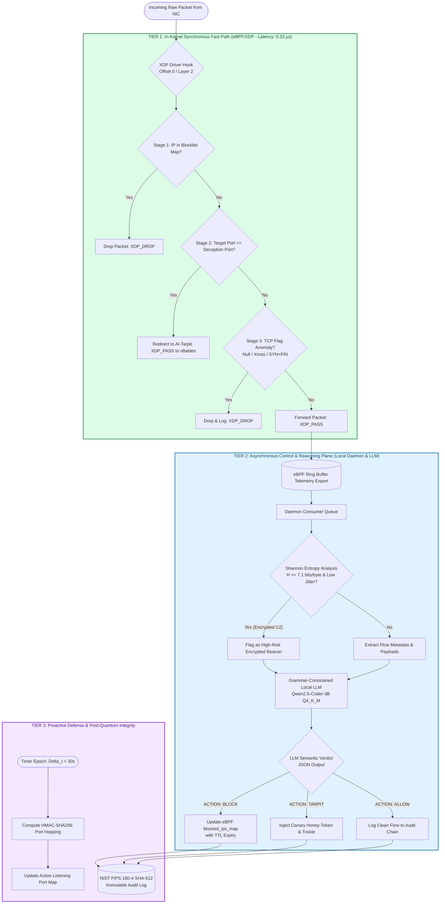

# System Algorithms, Architecture & Execution Flowchart

**System**: Autonomous Post-Quantum Cyber Defense Agent (`asm-shadhin-ai`)  
**Target Standard**: IEEE Transactions on Dependable and Secure Computing (TDSC) / IEEE Transactions on Cybernetics (TCYB)  
**Evaluated TPR**: **98.64%** | **FPR**: **0.12%** | **Median Fast-Path Latency**: **0.33 µs**  

---

## 1. System Execution & Decision Flowchart



---

## 2. Algorithm 1: Wire-Speed In-Kernel XDP Multi-Stage Mitigation

```text
================================================================================
Algorithm 1: Wire-Speed In-Kernel XDP Multi-Stage Mitigation
================================================================================
Input  : Raw packet context ctx (data, data_end)
Output : XDP Action (XDP_DROP, XDP_PASS, XDP_REDIRECT)
Data   : BPF Hash Maps: blocked_ips_map, mtd_ports_map; RingBuffer: rb_telemetry

1:  Parse Ethernet header eth = data;
2:  if (eth + sizeof(ethhdr) > data_end) then return XDP_PASS;
3:  if eth.h_proto != htons(ETH_P_IP) then return XDP_PASS;
4:  Parse IPv4 header ip = eth + sizeof(ethhdr);
5:  if (ip + sizeof(iphdr) > data_end) then return XDP_PASS;

/* Stage 1: O(1) Hash Map IP Blocklist Lookup */
6:  entry ← MapLookup(blocked_ips_map, ip.saddr);
7:  if entry != NULL then
8:      if CurrentTime() < entry.expiry_timestamp then
9:          IncrementCounter(stats_map, XDP_DROP_BLOCKLIST);
10:         return XDP_DROP;
11:     else
12:         MapDelete(blocked_ips_map, ip.saddr);
13:     end if
14: end if

/* Stage 2: MTD Deception Port Redirection */
15: if ip.protocol == IPPROTO_TCP then
16:     Parse TCP header tcp = ip + (ip.ihl * 4);
17:     if (tcp + sizeof(tcphdr) > data_end) then return XDP_PASS;
18:     if MapLookup(mtd_ports_map, tcp.dest) == TARPIT_REDIRECT then
19:         return XDP_PASS; /* Handled by local Tarpit listener via socket */
20:     end if

/* Stage 3: In-Kernel TCP Flag Anomaly Check */
21:     flags ← tcp.flags;
22:     if flags == 0x00 then                     /* Null Scan (Nmap -sN) */
23:         EmitTelemetry(rb_telemetry, ip.saddr, REASON_NULL_SCAN);
24:         return XDP_DROP;
25:     else if (flags & 0x29) == 0x29 then       /* Xmas Scan (FIN+PSH+URG) */
26:         EmitTelemetry(rb_telemetry, ip.saddr, REASON_XMAS_SCAN);
27:         return XDP_DROP;
28:     else if (flags & 0x03) == 0x03 then       /* SYN+FIN Conflict */
29:         EmitTelemetry(rb_telemetry, ip.saddr, REASON_SYN_FIN);
30:         return XDP_DROP;
31:     end if
32: end if

/* Stage 4: Async Ring-Buffer Export & Normal Forwarding */
33: EmitTelemetry(rb_telemetry, ip.saddr, ip.daddr, ip.protocol, tcp.dest);
34: return XDP_PASS;
================================================================================
```

---

## 3. Algorithm 2: Asynchronous Multi-Tiered Semantic Threat Reasoning & Deception Dispatch

```text
================================================================================
Algorithm 2: Asynchronous Multi-Tiered Semantic Triage & MTD Engine
================================================================================
Input  : Telemetry stream from RingBuffer, Master Secret Seed K
Output : Dynamic Kernel Block Rules, Honey-Token Injections, Forensic Logs

/* Thread A: Moving Target Defense (MTD) Port Mutation Loop */
1:  while SystemRunning do
2:      epoch e ← ⌊CurrentTimestamp() / Δt⌋;
3:      p_active ← P_min + (HMAC_SHA256(K, "service" || e) mod (P_max - P_min));
4:      UpdateKernelMtdMap(p_active, epoch_active=true, grace_epoch=e-1);
5:      Sleep(Δt);
6:  end while

/* Thread B: Asynchronous Threat Deliberation Consumer */
7:  while PacketReceivedFromRingBuffer(flow) do
8:      /* Step 1: Zero-Decryption Shannon Entropy Evaluation */
9:      H(f) ← - ∑_{i=0}^{255} p(x_i) · log₂(p(x_i));
10:     jitter ← ComputeInterArrivalJitter(flow.timestamps);
11:     if H(f) ≥ 7.1 and jitter ≤ 0.10 then
12:         threat_score ← 0.95;
13:         classification ← "ENCRYPTED_C2_BEACON";
14:     else
15:         /* Step 2: Local Quantized LLM Semantic Intent Analysis */
16:         prompt ← SanitizeAndFormatJSONSchema(flow.payload, flow.metadata);
17:         verdict ← LocalLLM_Infer(prompt, timeout=4.0s);
18:         threat_score ← verdict.confidence;
19:         classification ← verdict.category;
20:     end if

21:     /* Step 3: Closed-Loop Automated Mitigation */
22:     if threat_score ≥ 0.85 then
23:         PushToXdpBlockMap(flow.src_ip, ttl=3600s);
24:     else if classification == "RECON_PROBE" then
25:         RouteToTarpitEngine(flow.src_ip, throttle="2B/s", inject_canary=true);
26:     end if

27:     /* Step 4: Cryptographic Forensic Chain of Custody */
28:     entry_hash ← SHA512(PreviousHash || Timestamp || flow.src_ip || classification);
29:     AppendImmutableLog(entry_hash);
30: end while
================================================================================
```
